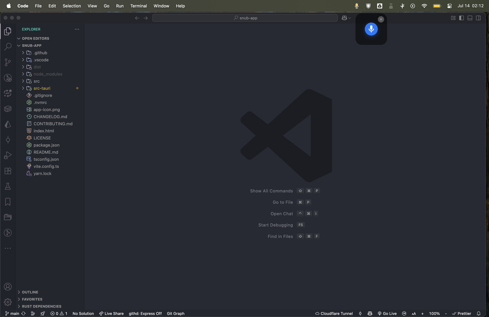
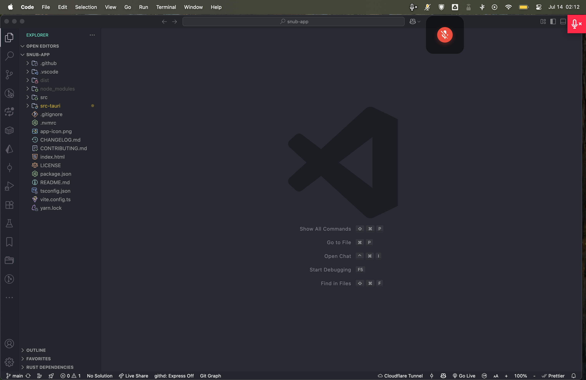

# Snub

**Snub** is a minimal macOS utility application that provides a simple interface to toggle your system microphone on/off. The app features a clean floating window with a single microphone icon that you can click to instantly mute or unmute your microphone.

## Screenshots

<div align="center">
  
  
  
  *Snub's minimal floating window showing unmuted (left) and muted (right) states*
</div>

## Features

- **🎤 One-Click Microphone Toggle** - Single click to mute/unmute your system microphone
- **🪟 Floating Window** - Minimal 100x100px rounded window that stays on top
- **🔕 Dock-Free** - Runs as a background utility without cluttering your dock
- **🎨 Modern UI** - Glassmorphism design with transparency and blur effects
- **🌙 Dark Mode Support** - Automatically adapts to your system theme
- **📱 System Tray Integration** - Access controls from the menu bar
- **⌨️ Keyboard Shortcuts** - Close with Escape, toggle with Spacebar
- **🚀 Native Performance** - Built with Rust and Tauri for optimal speed

## Installation

### Prerequisites

- **Node.js** 20.11.0 (see `.nvmrc` file)
- **Yarn** package manager
- **Rust** (latest stable version)
- **macOS** (required for microphone control)

### Setup

1. Clone the repository:
   ```bash
   git clone https://github.com/mustafademirtas/snub-app.git
   cd snub
   ```

2. Use the correct Node.js version (if using nvm):
   ```bash
   nvm use
   ```

3. Install dependencies:
   ```bash
   yarn install
   ```

4. Run in development mode:
   ```bash
   yarn tauri dev
   ```

5. Build for production:
   ```bash
   yarn tauri build
   ```

## Usage

### Window Controls
- **Click microphone icon** - Toggle mute/unmute
- **Hover over window** - Close button appears
- **Drag anywhere** - Move the window around your screen
- **Press Escape** - Close the window
- **Press Spacebar** - Toggle microphone when window is focused

### System Tray
- **Toggle Microphone** - Quick mute/unmute from menu bar
- **Show Window** - Bring the floating window back if hidden
- **Quit** - Exit the application

### Visual Feedback
- **Blue icon** - Microphone is active (unmuted)
- **Red icon** - Microphone is muted
- **Tray icon changes** - Reflects current microphone state

## Requirements

- **macOS** - Required for microphone control functionality
- **Node.js & Yarn** - For building the frontend
- **Rust** - For compiling the Tauri backend

## Architecture

**Snub** is built with:
- **Frontend**: TypeScript + Vite + Vanilla CSS
- **Backend**: Rust with Tauri v2
- **UI Framework**: Custom glassmorphism design
- **System Integration**: Native macOS APIs via osascript

## Development

### Project Structure
```
src/               # TypeScript frontend
├── main.ts        # App logic and Tauri commands
├── styles.css     # UI styling and animations
└── assets/        # Icons and resources

src-tauri/         # Rust backend
├── src/lib.rs     # Main application logic
├── src/main.rs    # Entry point
└── icons/         # App and tray icons
```

### Key Commands
- `yarn dev` - Start development server
- `yarn build` - Build for production
- `yarn tauri dev` - Run Tauri development mode
- `yarn tauri build` - Create distributable app

## Recommended IDE Setup

- [VS Code](https://code.visualstudio.com/) + [Tauri](https://marketplace.visualstudio.com/items?itemName=tauri-apps.tauri-vscode) + [rust-analyzer](https://marketplace.visualstudio.com/items?itemName=rust-lang.rust-analyzer)

## Support the Project ☕

If **Snub** has saved you from those awkward "Sorry, you were on mute" moments, consider buying me a coffee! Your support helps keep this little utility alive and kicking.

**Crypto Wallet Address:**
```
0x0d9B1a17A9D405485049Bd35e423963F75D94aF4
```

*Every donation, no matter how small, is deeply appreciated and goes directly toward improving Snub and developing new features. Plus, it keeps me caffeinated enough to debug why the microphone toggle sometimes has a mind of its own!*
